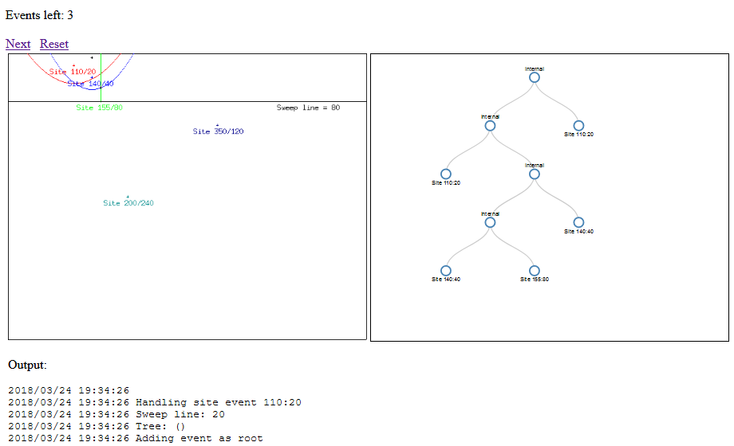

# voronoi

Golang package for generation of voronoi diagrams with Fortune's algorithm.

*Work in progress. Calculates verticies, but is not yet building a full DCEL data structure with the results.*

## TODO:
- [ ] Connect unfinite half-edges to the bounding box.

## How to debug

```go
cd cmd
go run player.go
```

`player` is a standalone tool (standalone web server) for visualization of the algorithm of [github.com/quasoft/voronoi](https://github.com/quasoft/voronoi) in steps:



Pressing the [Next] link advances the algorithm to the next event and updates the visualization at the left.

The graph at the right reflects the state of the binary tree with parabola arcs.